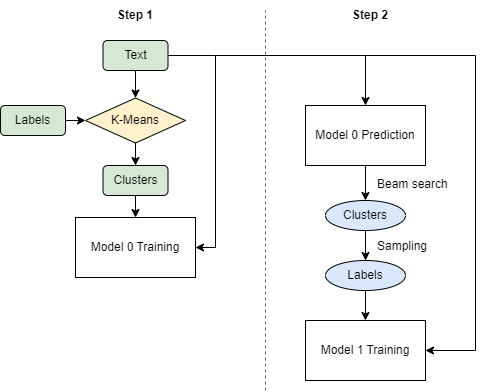

Handling Data with Many Labels with AttentionXML
================================================
As time and space complexities grow linearly as the label size increases, it is inefficient to train models in its
original label space. We consider adopting AttentionXML :cite:p:`RY19a` to address the issue by training
models with a reduced space of labels.

Usage
-----
It is recommended to run AttentionXML through a configuration file. For example, to test AttentionXML on Wiki10-31K,
run the following code:

.. code-block:: console

    $ python main.py -c example_config/Wiki10-31K/attentionxml.yml

Training Process
----------------
Roughly speaking, training AttentionXML takes two steps. First, a model (model 0) is trained to predict clusters (rather
than labels). Then, another model (model 1) is trained to predict labels. Both models involve a BiLSTM layer with
label-wise attention.

One significant distinction between AttentionXML and one-vs-all algorithms is that in training model 1, AttentionXML
only updates weights related to only a subset of the original label space (in the attention layer) during
backpropagation, thereby increasing training speed.

Hyperparameters
---------------

There are 2 extra hyperparameters for AttentionXML that users need to know:

* **cluster_size**: The maximal number of labels in a cluster.
* **beam_width**: The process of selecting predicted clusters from model 0 is called beam search. Beam width indicates
  the number of clusters that will be selected.

Performance
-----------
We compared the performance between BiLSTM and AttentionXML as they have similar architectures. The datasest,
Wiki10-31K, has 30,938 classes, which makes it hard for models to train in a one-vs-all manner.

Both models were trained on an A100 Nvidia GPU. Their test results are shown below. Notice the difference
between their running time.

.. list-table::
   :widths: 80 60 60 60 60
   :header-rows: 1
   :stub-columns: 1

   * - Performance
     - P@1
     - P@3
     - P@5
     - Time (min)
   * - BiLSTM
     - 84.48
     - 75.91
     - 66.88
     - 87.1
   * - AttentionXML
     - 87.44
     - 77.70
     - 67.85
     - 29.9
